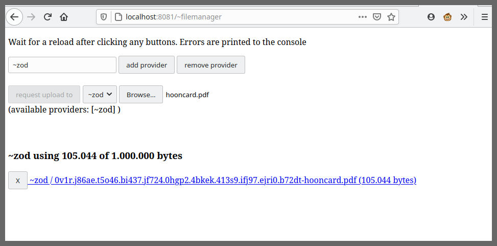

## Client Operating Manual

The client app includes an html interface to upload files to any configured providers.
### How to install


#### Create a moon

Since the project isn't stable yet, you should use a moon instead of your normal ship. In the dojo terminal run the following command:

```
~your-ship:dojo> |moon
>=
moon: ~some-long-your-ship
0v31a.6auka.k6f4c.dhr56.9uig5.pcktv.t98mv...
```

Now in a normal terminal start the moon by running:

```
user@computer:~$ echo "0v31a.6auka.k6f4c.dhr56.9uig5.pcktv..." > keyfile

# first boot
user@computer:~$ ./binaries/urbit -w some-long-your-ship -k keyfile

# later boots
user@computer:~$ rm keyfile
user@computer:~$ ./binaries/urbit ./some-long-your-ship
```

Wait until running `+trouble` shows the same base hash on the moon as your main ship. Give it a minute. Use the `|ames-verb %rcv` command to view ota progress.

#### Install the gall app

Back on the moon dojo
```
# moon dojo
~your-ship:dojo> |mount %

# terminal 
user@computer:~$ git clone --depth 10 https://github.com/aquarial/urbit-lfs-filehosting/
user@computer:~$ rsync --archive --ignore-times \
                    ./urbit-lfs-filehosting/gall-app/ ./some-long-your-ship/home/

# moon dojo
~your-ship:dojo> |commit %home
~your-ship:dojo> |start %lfs-client
```

#### How to use

At this point you can go to `http://localhost:8080/~filemanager` (use the http address of the moon instead of localhost) to see the following interface.

NOTE: streaming file upload doesn't work yet, so the ui can only upload files under a certain size. A 413 error means it was too big.



For now, errors are only printed to the browser console. Open the console by right-clicking the page, "Inspect Element". Or Keyboard shortcut `Control-Shift-i`

Other messages are printed to the dojo terminal window.


For more technical details, see [client-tech.md](./client-tech.md)
